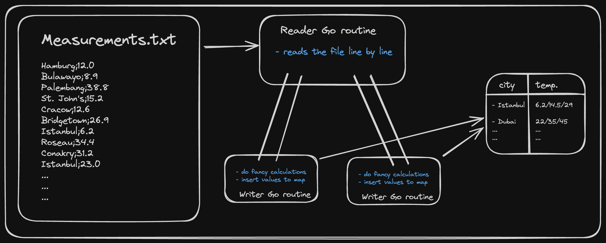

# 1brc

This repository contains my implementation of 1 Billion Row Challenge in GO. The motive of this challenege was to read 1 billion rows from a file, perform some calculations and print the output as fast as possible. With my best implementation I was able to do all of that in about `21s`. All the iterations from brute force to the best implementaion can be checked from git history. Commits were made at every step.